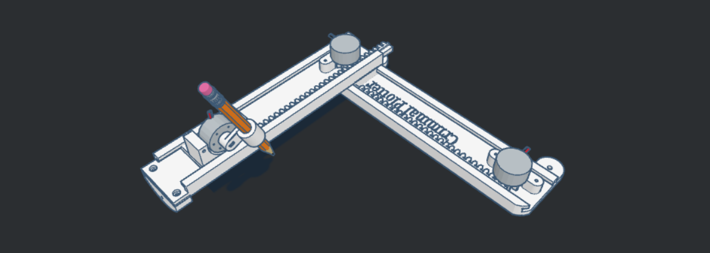
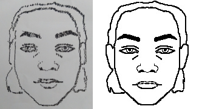

# CriminalPlotter

**Data**: Outubro de 2024  

## Requisitos Mínimos

python 3

## Instalação

Para baixar o código, use:

    mkdir CriminalPlotter && cd CriminalPlotter
    git clone https://github.com/NicolasAuersvalt/CriminalPlotter.git
    cd CriminalPlotter

Para instalar as bibliotecas, execute o script `instalador.sh`:

    chmod +x instalador.sh CriminalPlotter.sh conversorMatrizes.sh conversorImagens.sh limpador.sh
    ./instalador.sh

---

## Execução

Após a instalação, para executar o projeto, utilize:

    ./CriminalPlotter.sh

Caso deseje apenas converter as imagens para matrizes, utilize:

    ./conversorMatrizes.sh

Para converter para imagens, copie as matrizes que deseja compor para a pasta impressao, e execute:

    ./conversorImagens.sh

Ao terminar a impressão, a imagem estará numerada (sendo o maior dígito) em "Banco de Retratos". Para limpar o diretório e começar outra impressão, utilize:
    
    ./limpador.sh

Assim, seu diretório estará limpo e pronto para iniciar outra impressão. Para iniciar a análise e montar o rosto com maior probabilidade de ser um criminoso, utilize:

    ./analisador.sh

Com isso, será lido o arquivo matrizes_metadata.json e elaborada uma matriz com todas as características que mais apareceram nas últimas impressões, a imagem final será gerada no repositório impressao/analisado. Para limpar esse metadata e iniciar uma nova análise, use:

    ./limparAnalise.sh

Portanto, será possível iniciar uma nova análise.

---

Abstract
In 2023, Brazil recorded 47,722 murders and an average of 2,226 robberies and thefts per 100,000 inhabitants. These numbers become even more alarming considering that the crime resolution rate is 65%, dropping to around 35% for homicides.

One major factor contributing to the low resolution rate is the shortage of resources and professionals: Brazil has an average of one forensic expert per 41,500 inhabitants, while the UN recommends at least one per 5,000. In São Paulo, for instance, forensic experts may travel up to 300 km in a single day to visit as many as 17 different crime scenes. This overload results in many cases being neglected and, even when attended, the lack of time prevents a thorough investigation.

To help mitigate this issue, the authors developed a modified "CNC Plotter" printer capable of sketching criminal portraits of potential suspects based on a predefined catalog of facial features, eliminating the need for an on-site forensic artist.

Resumo
Em 2023, o Brasil registrou 47.722 homicídios e uma média de 2.226 roubos e furtos por 100 mil habitantes. Esses números tornam-se ainda mais alarmantes ao considerar que a taxa de solução de crimes é de 65%, caindo para cerca de 35% em casos de homicídio.

Um dos principais fatores responsáveis pela baixa resolução de casos é a escassez de recursos e profissionais: o Brasil possui, em média, um perito criminal para cada 41.500 habitantes, enquanto a ONU recomenda ao menos um para cada 5.000. No estado de São Paulo, por exemplo, peritos podem percorrer até 300 km em um único dia para atender até 17 locais de crime diferentes. Esse sobrecarga faz com que muitos casos sejam negligenciados e, mesmo nos atendidos, a falta de tempo impede uma análise detalhada.

Para mitigar esse problema, os autores desenvolveram uma impressora "CNC Plotter" modificada, capaz de esboçar retratos criminais de potenciais suspeitos com base em um catálogo pré-definido de traços faciais, eliminando a necessidade de um artista forense no local.

## Introdução  

Em 2023, o Brasil registrou **47.722 homicídios**, representando **10,4% do total mundial**, segundo [ONU](#). Em homicídios per capita, o país ocupa a **11ª posição**, com **22,38 mortes para cada 100 mil habitantes**, número **quase 1.000% superior à média da OCDE**, **400% maior que a média global** e **150% acima da média da América Latina**, de acordo com [OECD](#). Além disso, no que se refere a **roubos e furtos**, o Brasil apresenta uma taxa de **2.226 ocorrências para cada 100 mil habitantes**, conforme relatório da [FGV](#).  

A situação torna-se ainda mais preocupante ao considerar que a **taxa de resolução de crimes no Brasil é de apenas 65%**, conforme estudos da [Adepol](#), sendo **apenas 35% no caso de homicídios**, segundo dados do [Sou da Paz](#).  

Um dos principais fatores que dificultam a solução dos casos é a **escassez de recursos e profissionais**. De acordo com a [FAPESP](#), o Brasil possui, em média, **um perito criminal para cada 38.000 habitantes**, enquanto a **ONU recomenda ao menos um para cada 5.000**. No estado de São Paulo, por exemplo, um único perito pode percorrer até **300 km em um dia** para atender **até 17 cenas de crime**, resultando em um número significativo de ocorrências não investigadas ou analisadas de maneira superficial devido à falta de tempo.  

Diante desse cenário, os autores propõem o desenvolvimento de uma **impressora "CNC Plotter" adaptada para esboço forense de rostos**, caracterizada por sua **facilidade de operação, baixo custo e fundamentação em métodos já existentes de retrato forense e reconhecimento facial**. Essa solução visa **dar maior autonomia às testemunhas e reduzir a sobrecarga da perícia criminal**. A autonomia das testemunhas é especialmente relevante em casos onde estas sofrem de **Transtorno de Estresse Pós-Traumático (PTSD)**, pois, conforme indicado por [Morganstein et al.](#) e [Parra et al.](#), indivíduos nessa condição podem apresentar dificuldades para comunicar informações detalhadas.  

## Revisão de Literatura  

### O procedimento forense  

De acordo com [Klum et al.](#), esboços forenses são amplamente utilizados na ausência de registros fotográficos ou em vídeo do suspeito. Eles podem ser elaborados de duas formas: **desenhados manualmente por um artista** ou **gerados digitalmente** a partir da composição de elementos faciais armazenados em uma base de dados. O segundo método é mais recente e tem ganhado espaço, conforme apontado por [McQuiston et al.](#).  

Ainda segundo [Klum et al.](#), após a elaboração do esboço, a imagem pode ser **divulgada em veículos midiáticos** ou **utilizada em buscas em bancos de dados criminais**. [Bahrum et al.](#) destacam que essa busca pode considerar **o rosto como um todo** ou **apenas algumas de suas características individuais**. Neste trabalho, no entanto, limitamo-nos exclusivamente à **geração do esboço**, sem aplicações diretas em **reconhecimento facial automatizado**.  

### O método do esboço  

Embora **biometria, DNA e outros métodos de identificação** sejam altamente precisos, o esboço criminal forense ainda é amplamente utilizado devido à sua **conveniência e menor custo**, conforme explicado por [Tang et al.](#). No entanto, esse método apresenta a **desvantagem de exigir peritos especializados**, com anos de prática, como apontado por [Klum et al.](#), uma realidade distante do contexto brasileiro.  

Uma alternativa tem sido o **esboço composto via software**, amplamente adotado desde os anos 2000, segundo [McQuiston et al.](#) e [Galea et al.](#). No Brasil, entretanto, onde apenas recentemente foi inaugurado um **sistema de reconhecimento facial** – conforme noticiado por [São Paulo et al.](#) –, essa tecnologia ainda está longe de ser aplicada em larga escala, tornando necessária uma **adaptação da técnica**.  

A teoria de identificação facial teve sua gênese na década de 1960, com os estudos de [Bledsoe et al.](#), que utilizaram computadores para analisar **20 medidas de componentes faciais** inseridas manualmente pelo usuário.  

Na década de 1970, pesquisas conduzidas por [Harmon et al.](#) e [Goldstein et al.](#) propuseram um **algoritmo de busca binária** para encontrar um rosto com base em **21 características faciais**, conforme ilustrado na **Figura 1**. Nesse estudo, os participantes recebiam **255 retratos** e tinham a tarefa de separá-los em duas pilhas: aqueles que possuíam a característica informada e aqueles que não a tinham.  

Os resultados foram descritos como "**surpreendentemente bons**" por Harmon, alcançando uma taxa de **53% de acerto** com uma média de **7,3 características utilizadas**. Além disso, em **75% dos casos**, o retrato correto estava entre os **últimos 13 selecionados**.  

Segundo [Samal et al.](#) e [Adjabi et al.](#), na década de 1980 esse campo de estudo ficou relativamente dormente, retornando com força na década seguinte devido a diversos avanços tecnológicos, como a **inteligência artificial**, que eliminou a necessidade de características subjetivas usadas anteriormente.  

Nesse contexto, dois pesquisadores do MIT, [Turk et al.](#), inventaram em 1991 o primeiro sistema de reconhecimento facial, chamado **"Eigenfaces"**. Em 1998, a agência governamental dos EUA **DARPA** criou a primeira **base de imagens robusta**, contendo **2.400 fotos de 850 pessoas**.  

Por fim, [Adjabi et al.](#) concluem que outra revolução ocorreu com o desenvolvimento do **Deep Learning** e redes neurais na década de 2010. Em 2014, por exemplo, o **Facebook** anunciou que seu algoritmo **"DeepFace"** conseguia reconhecer faces com **97% da precisão humana**, conforme exemplificado por [Taigman et al.](#).  

De modo geral, [Hatem et al.](#) e [Ding et al.](#) explicam que os sistemas mais modernos variam entre duas abordagens principais: **reconhecimento baseado em componentes faciais** e **reconhecimento da imagem como um todo**. Na década de 2020, os modelos de **Deep Learning** evoluíram a ponto de **se aproximarem da performance de especialistas em reconhecimento facial**. No entanto, a **maior precisão é alcançada quando ambos trabalham em conjunto**, como demonstrado por [O'Toole et al.](#).  

## Materiais e Métodos  

### Catálogo de características faciais  

Da revisão de literatura, entende-se que a abordagem mais adequada à realidade do país seria a criação de um **catálogo de características faciais** que mimetiza o conceito de esboço composto, mas sem a necessidade de um software. No entanto, se não houver uma base de dados, surge o problema de como determinar quantas características seriam necessárias para definir um rosto aproximado do criminoso.  

Baseados nos modelos de **Harmon et al.**, sabemos que existem **9 componentes faciais** divididas em **21 características** que podem ser utilizadas para diferenciar rostos com **segura assertividade**. Isso significa que essas características podem ser usadas para gerar um banco de dados de componentes faciais, mimetizando o método de esboço via software.  

Nesse contexto, os autores reduziram para **19 características faciais**, mantendo o número de possibilidades de cada uma, conforme exposto na **Tabela 1**. As características foram utilizadas da seguinte maneira:  
- **Olhos**: 3 características, com 3 possibilidades cada, totalizando **27 tipos diferentes** de olhos.  
- **Cabelo**: 19 possibilidades, pois "careca" não tem "tamanho" nem "textura".  
- **Bochechas**: 3 possibilidades, pois só possuem uma característica, e assim por diante.  

Multiplicando as possibilidades de cada componente, é possível gerar aproximadamente **545 milhões de rostos distintos** com um banco de dados de apenas **124 componentes**.  

A **eliminação da cor de cabelo** foi realizada porque o **plotter** não consegue alterar a cor da impressão. Além disso, a característica de **largura dos lábios**, antes dividida em "maior" e "menor", foi unificada para criar **27 tipos de boca**, ao invés dos **81** que seriam mais da metade dos desenhos de componentes.  

Em consonância com o catálogo, os autores criaram uma **impressora CNC Plotter modificada** que, através da técnica de **pontilhação**, imprime o esboço com as **componentes faciais** selecionadas pelo usuário. Como [Samal et al.](#) demonstraram, a relevância das características faciais tende a reduzir do cabelo até o queixo, e, por isso, as componentes também são escolhidas nessa ordem.  

### CNC Plotter  

O **CNC Plotter** é um projeto relativamente comum no campo da eletrônica, e envolve os seguintes componentes:  
- **Microcontrolador**  
- **Motor de passo** e **driver** para cada haste da impressora (geralmente um eixo **2D** ou **3D**, com algumas versões utilizando um **servo motor** para o eixo Z)  
- **Adaptador USB-Serial**, caso necessário  
- **CNC Shield** para conexão com o microcontrolador  
- **Aparato de desenho**  

A programação geralmente é realizada utilizando **G-code** (RS-274), e o projeto é frequentemente utilizado junto com softwares de **desenho de código aberto**, como **Inkscape**.  

Exemplos de projetos semelhantes podem ser encontrados em [Girhe et al. (2018)](#), [Hasan et al. (2018)](#), [Nsayef et al. (2018)](#) e [Hyder et al. (2020)](#).

### Materiais utilizados

- **Motor de passo 28BYJ-4 - 5V e driver ULN2003**:  
  Como explica [Hyder et al. (2020)](#), um motor de passo é um motor elétrico DC sem escovas que divide uma rotação completa em etapas iguais. O motor utilizado neste projeto tem um ângulo de passo de **5,625º** e razão de redução de **1/64**, o que significa que cada passo gira aproximadamente **0,088º**. No entanto, como detalhado na seção 4.2, uma precisão assertiva não pode ser alcançada com um passo tão pequeno. O motor de passo controla um eixo do "Plotter", e foram utilizados **3 motores**. Optou-se por não usar um motor servo no eixo Z, como feito em [Hyder et al. (2020)](#) e [Nsayef et al. (2018)](#), devido à limitação do projeto que não pode contar com uma "CNC Shield", mas sim com uma placa universal com solda. O driver **ULN2003** foi escolhido em vez de uma shield com **L293D**, como utilizado por [Nsayef et al. (2018)](#), por ser mais flexível e garantir a utilização de portas digitais apenas para os motores. O motor de passo e seu respectivo driver podem ser vistos na **Figura 6**.

- **Arduino Blackboard R3**:  
  Utilizou-se o **Arduino Uno**, um software e hardware de código aberto projetado como uma unidade de microcontrolador. Como explicado por [Hasan et al. (2018)](#), o Arduino Uno possui **14 portas digitais** e **6 analógicas**, sendo o modelo mais usado no "CNC Plotter" devido à sua fácil e intuitiva interface, **Arduino IDE**. No entanto, a limitação de memória do Arduino Uno foi contornada por meio de um código Python executado pelo computador, conforme explicado nas seções 3.6 e 3.7. A imagem do **Arduino Uno** utilizado está na **Figura 4**.

- **Adafruit Membrane 3x4 Matrix Keypad**:  
  Devido à falta de portas no **Arduino Uno**, a linha 3, com os números **7**, **8** e **9**, não pôde ser utilizada. Isso impôs uma limitação ao projeto, pois existem 9 componentes faciais e apenas 7 algarismos disponíveis. Detalhes de como essa limitação afetou o funcionamento do projeto podem ser encontrados na **seção 3.6**.

- **Filamento PLA branco (500g)**:  
  A parte física do **plotter** foi modelada no **Tinkercad** (veja as **Figuras 7 e 8**) e impressa sem custos no laboratório **MEI-u** da **Universidade Tecnológica Federal do Paraná (UTFPR)**, campus Curitiba, utilizando **filamento PLA branco (500g)**. O modelo impresso é mostrado nas **Figuras 7 e 8**, e os materiais impressos estão ilustrados na **Figura 11**.

### Otimização de desempenho

Para garantir a padronização do ponto de início do desenho (0,0) e maximizar o alcance da área de impressão, optou-se por restringir a movimentação utilizando parafusos, sem a dependência de bibliotecas externas. O deslize contínuo sobre o PLA exigiu um processo intensivo de lixamento e testes, e foi aplicado **spray de silicone** como lubrificante para reduzir o atrito e garantir proteção extra às peças.

Além disso, a movimentação da peça foi cuidadosamente ajustada para evitar deslocamentos indesejados durante o uso. A caneta foi posicionada em um ângulo fixo próximo a **45° em repouso**, e, durante a descida, foi necessário evitar que ela ficasse paralela ao eixo **Y**. Essa configuração poderia causar riscos indesejados ou ultrapassar os limites da área de desenho, movendo-se para um quadrante onde não há contato com o papel. O mecanismo utiliza a própria limitação física da caneta tocando o papel para controlar sua movimentação. A fixação da caneta foi realizada por **pressão** dentro de um compartimento específico, reforçada com parafusos.

### Funcionamento do Criminal Plotter

O **Criminal Plotter** conta com uma série de códigos destinados à comunicação entre o computador e o Arduino, bem como à manipulação de imagens e matrizes. O processo, resumido na **Figura 11**, segue as etapas automatizadas abaixo para garantir eficiência e integração:

### Etapas do Processo

1. **Conversão de Imagens para Matrizes:**  
    A execução começa com um script que processa todas as imagens presentes no diretório `imagens`. Essas imagens, no formato **180x180 pixels** em tons preto e branco (valores 0 ou 255), são convertidas em matrizes binarizadas. As matrizes resultantes são armazenadas no diretório `matrizes`, mantendo os nomes originais das imagens. Esses nomes servem como identificadores essenciais para as etapas seguintes.

2. **Comunicação Principal com o Arduino:**  
    Em seguida, é executado o código principal em Python, responsável pela comunicação com o Arduino via serial, utilizando uma taxa de transmissão de **9600 baud**. Esse código copia a matriz selecionada pelo usuário no diretório `matrizes` para o diretório `impressao`, lê a matriz correspondente e, por fim, transmite os dados ao Arduino para controle do dispositivo. A interação é contínua enquanto o código estiver em execução, permitindo que o usuário realize múltiplas impressões com diferentes matrizes.

3. **Soma de Matrizes no Diretório de Impressão:**  
    Quando o usuário decide encerrar a impressão (pressionando **Ctrl+C**), um terceiro código em Python é acionado. Este realiza a soma de todas as matrizes presentes no diretório `impressao`, gerando uma matriz composta. A soma respeita uma limitação binária, não ultrapassando o valor **1** para garantir consistência nos resultados. Caso o usuário tenha omitido algum componente durante o processo de impressão, a matriz final poderá resultar em formas incompletas.

4. **Conversão Final e Limpeza de Matrizes:**  
    Por fim, um último código converte a matriz composta de volta para o formato **PNG**, gerando uma imagem final que pode ser salva pelo usuário. Após a conversão, o diretório `impressao` é limpo automaticamente, apagando todas as matrizes para evitar a sobreposição de desenhos em futuras utilizações.

### O código

O código desenvolvido em linguagem **Arduino** (.ino), cujo trecho está disponível na figura 12, difere consideravelmente da literatura, dada a diferença radical de propósito. 

Ele começa com a definição de **variáveis globais**, amplamente utilizadas ao longo da execução, além do **mapeamento do teclado Num Pad** com suas limitações funcionais e a **inicialização dos motores de passo**. Após cada ação específica, é realizada uma sinalização, positiva ou negativa, que consiste na ativação sequencial e breve dos motores. 

Esse processo visa acionar os **LEDs de cada módulo ULN2003**, criando um **feedback visual**. No entanto, essa sinalização provoca pequenas rotações indesejadas nos motores, que precisam ser corrigidas posteriormente.

### Fluxo Principal do Programa

O programa segue um fluxo principal que opera por meio de **encadeamentos**. A cada ciclo, o código aguarda dois inputs:

1. O primeiro input pode ser um **valor numérico** ou o **caractere de cancelamento** (utilizado para reinicializar os motores no primeiro ciclo).
2. O segundo input deve ser obrigatoriamente o **caractere de confirmação (*)** ou de **cancelamento (#)**.

Esse processo de encadeamento é repetido três vezes, com diferentes sinalizações de eventos para indicar o progresso das operações.

Após o encadeamento, a função **"desenhar"** é executada. Essa função posiciona o motor **Z** na altura apropriada para a tarefa de desenho e envia um sinal **"Pronto"** para a interface Python, solicitando o envio de dois valores numéricos correspondentes às coordenadas **x** e **y** do próximo ponto.

O código compara a posição atual com as coordenadas recebidas, determinando a direção de movimento necessária. Na posição alvo, a função **"canetar"** é acionada, que baixa e levanta a caneta para marcar um ponto no local especificado. Após concluir a operação, o código retorna o sinal **"Pronto"** para o Python, indicando que está preparado para receber novos comandos.

### Fluxo Completo de Comunicação e Desenho

O fluxo de execução do código segue um loop contínuo até que a comunicação com o Python seja interrompida. O código Python estabelece a comunicação com o Arduino de forma a garantir uma conexão estável entre os dispositivos. 

1. Inicialmente, o Python aguarda o sinal **"Pronto"** enviado pelo Arduino, acompanhado de três caracteres que identificam o nome de um arquivo (por exemplo, **"123.txt"**).
2. Com base nessa identificação, o código busca no diretório de matrizes o arquivo correspondente.
3. Após localizar o arquivo, o código realiza a leitura da matriz e percorre seus elementos em busca de valores iguais a **1**. Quando um valor **1** é encontrado, suas coordenadas são armazenadas em uma fila.

### Envio das Coordenadas ao Arduino

Ao término da leitura e processamento da matriz, o código entra em um laço onde cada posição armazenada na fila final é enviada ao Arduino, respeitando a sequência calculada previamente. Após cada envio, o código aguarda o sinal **"Pronto"** do Arduino antes de continuar com a próxima posição.

Esse ciclo se repete de forma contínua, garantindo a comunicação eficiente e o processamento da imagem entre o **Python** e o **Arduino**, permitindo a impressão do esboço no **CNC Plotter**.

### Qualidade do Esboço e Limitações Atuais do Catálogo

Devido à limitação de tempo na execução do projeto, foi possível imprimir apenas dois rostos utilizando o catálogo, apresentados nas **Figuras 15** e **16**. Até o momento, não foram adicionados componentes faciais como acessórios, óculos, brincos ou piercings, o que compromete significativamente a capacidade de associar o esboço a pessoas reais.

Para testar a qualidade do esboço, foram feitos dois desenhos extraordinários (sem base no catálogo). As imagens da pessoa, do PNG extraordinário e do esboço foram apresentadas a 90 participantes, com a questão de se os esboços poderiam ser usados para reconhecer a foto dos participantes. Os resultados estão apresentados na **Tabela 3**, e a montagem com as fotos, desenhos e esboços pode ser vista na **Figura 17**.

### Possíveis Melhorias e Parcerias

Para melhorar o catálogo, será necessário um método científico para incluir acessórios e características faciais adicionais. Isso pode ser feito em parceria com a **Unidade de Execução Técnico-Científica de Curitiba** – **Centro - Polícia Científica**, próxima à UTFPR. Esta delegacia especializada pode auxiliar na interpretação dos resultados e até melhorar os esboços.

### Desempenho e Otimizações

Em relação ao código, a impressão foi otimizada no que diz respeito ao tempo, armazenando as coordenadas com valor **1** em uma fila, o que separa a leitura da matriz da movimentação sobre o papel. Além disso, foi possível calcular o progresso do desenho, o que antes seria impossível sem a divisão dos atos.

Apesar dessas otimizações, um rosto com resolução de **180x180** leva cerca de uma hora para ser impresso. Isso significa que resoluções mais altas, como **780x780** ou até **1080x1080**, seriam impraticáveis em um contexto real. No entanto, com base nos resultados obtidos, não parece ser necessária uma resolução maior do que a utilizada.

### Precisão e Otimização

A precisão do **Criminal Plotter** depende de diversos fatores, como o polimento físico das peças, a resolução das imagens e matrizes, o posicionamento do papel (esticado corretamente), o modelo da caneta e a pressão aplicada por ela. Por isso, o sistema não é eficaz para desenhar matrizes com resolução inferior a **100x100** ou para a impressão de palavras com largura de apenas **1-2 pixels**.

O tempo de desenho mais demorado ocorre no início e no final de cada linha, devido ao movimento necessário, que percorre **O(n)** para cada linha. No pior cenário, ao desenhar um quadrado **180x180** preenchido, o tempo de execução é **O(n²)**.

Após a inicialização do processo de desenho, é necessário desconectar e reconectar o cabo do Arduino para iniciar a impressão do desenho, o que provavelmente está relacionado a limitações do próprio microcontrolador.

Além disso, o processo de lixamento das peças causou espaços que afetaram diretamente o desempenho do sistema. Como resultado, passos abaixo de **7 unidades** (**0,615°** aproximadamente) não são bem interpretados pela impressora. Nesses casos, o motor de passo movimenta a engrenagem, mas o vão entre as peças impede a transmissão eficiente do movimento, prejudicando a precisão do desenho.

### Desafios e Limitações Encontradas

1. **Material Usado e Acabamento das Peças**  
   O material utilizado para a impressão 3D e a impressão em si exigiram um acabamento completo de todas as peças. Esse processo demandou atenção detalhada para garantir o funcionamento adequado de cada parte do mecanismo.

2. **Problemas com Bibliotecas de Controle de Motores de Passo**  
   As bibliotecas testadas para controlar os motores de passo (modelo-do-motor) não funcionaram corretamente:
   - **AccelStepper** (versões antiga e nova): apresentaram problemas no controle de velocidade, desligamento dos motores, gerenciamento em cadeia e controle dos passos.
   - **Stepper**: não funcionava corretamente no sentido contrário, além de apresentar problemas de desligamento dos motores e operação em velocidade muito baixa.
   - **FastAccelStepper**: apresentou os mesmos problemas que a **AccelStepper**.

   Como resultado, foi necessário controlar os motores manualmente, sem o uso de bibliotecas. Isso envolveu atuar diretamente sobre cada polo dos motores para garantir que eles girassem nos dois sentidos. Também foi necessário determinar a velocidade ideal para a rotação, o delay adequado e como desativar os motores para evitar o consumo de energia quando não estivessem em uso. Vale destacar que um **delay** muito pequeno ou uma velocidade muito alta exigiam mais tensão dos **5V** disponíveis, fazendo com que os motores vibrassem sem realizar a rotação.

3. **Limitação das Portas no Arduino**  
   As portas **0** e **1** do Arduino são reservadas para a comunicação **RX** (recepção) e **TX** (transmissão), impossibilitando o seu uso para o controle dos motores ou do **keypad**. Devido a essa limitação e à quantidade reduzida de portas disponíveis, foi necessário desativar a última linha do **keypad**, já que não havia portas suficientes no **Arduino Uno R3**.

### Desafios e Ajustes no Processo de Desenvolvimento

1. **Material usado na impressão 3D e acabamento das peças:**  
   A impressão 3D das peças exigiu um acabamento completo, sendo necessário polir e ajustar cada peça para garantir o funcionamento adequado do sistema.

2. **Problemas com bibliotecas para controle dos motores de passo:**  
   As bibliotecas testadas para o controle dos motores de passo, como **AccelStepper**, **Stepper**, e **FastAccelStepper**, não funcionaram corretamente, apresentando problemas no controle de velocidade, desligamento dos motores, e gestão de cadeia de passos. Como resultado, foi necessário controlar os motores manualmente, atuando diretamente sobre cada polo para girar nos dois sentidos. Além disso, foi preciso ajustar a velocidade ideal de rotação, definir o delay adequado e garantir que os motores fossem desativados quando não utilizados para evitar consumo excessivo de energia.

3. **Limitações de portas no Arduino:**  
   O Arduino Uno R3 possui apenas 2 portas específicas para comunicação (RX e TX), o que impossibilitou o controle dos motores e do teclado numérico ao mesmo tempo. Como solução, a última linha do teclado foi desativada para contornar a limitação das portas.

4. **Alterações físicas para melhorar a precisão:**  
   Para garantir a precisão necessária, foi preciso fazer ajustes no modelo físico do **Criminal Plotter**. As oscilações do circuito e a movimentação das peças ao pressionar a caneta no papel prejudicavam a precisão, mesmo com as peças devidamente parafusadas. Assim, fixou-se a caneta em um ângulo específico para evitar o levantamento da estrutura, além de adicionar parafusos para limitar esse problema.

5. **Alimentação externa e controle dos motores:**  
   Inicialmente, a alimentação externa foi considerada uma alternativa devido aos problemas com as bibliotecas para controle dos motores. No entanto, ao resolver esses problemas, foi descartada a necessidade de alimentação externa, já que cada motor passou a ser operado de forma eficiente pela rotina de controle.

6. **Limitações de memória do Arduino para matrizes maiores:**  
   O Arduino não consegue armazenar matrizes com ordem superior a 10, o que gerava comportamentos inesperados. Para resolver esse problema, foi necessário estabelecer comunicação entre o Arduino e o computador por meio da biblioteca **pySerial** em Python. Assim, as matrizes são lidas e processadas pelo Python, que envia as coordenadas ao Arduino.

7. **Problemas na soldagem da Shield:**  
   A soldagem da Shield foi um fator que causou erros no projeto devido à qualidade do ferro de solda, pasta e jumpers de baixa qualidade, resultando em oscilações nos componentes.

8. **Ajustes na resolução e impactos na construção do catálogo:**  
   As constantes correções de erros e otimizações do **Criminal Plotter** exigiram ajustes na resolução do projeto, que foi alterada mais de 5 vezes. Isso atrasou significativamente a construção do catálogo, já que os desenhos levavam muito tempo para serem criados e a conversão dos pixels não alcançou o nível de qualidade desejado.

### Conclusão

O projeto **Criminal Plotter** propõe uma solução acessível para a elaboração de esboços faciais em investigações criminais. A implementação de uma interface otimizada e de baixo custo visa democratizar o acesso às ferramentas de perícia no Brasil, contribuindo para a melhoria das investigações em um cenário de escassez de especialistas.

Apesar dos avanços obtidos, o tempo disponível para o desenvolvimento do projeto foi insuficiente para uma otimização completa do catálogo de traços faciais. Além disso, dificuldades técnicas relacionadas à precisão da impressão e à comunicação entre os dispositivos foram desafios significativos. Melhorias futuras devem focar na redução do tempo de impressão e na integração de motores de passo mais eficientes, como o **Nema 17** usado por **Hasan et al. (2018)** e **Hyder et al. (2020)**, o que exigiria adaptações estruturais na impressora.

Por fim, recomenda-se que futuros desenvolvimentos incluam colaboração com peritos criminais para aprimorar os parâmetros do catálogo de traços faciais, avaliar a qualidade dos esboços gerados e validar sua aplicabilidade em casos reais. Essas melhorias podem fortalecer a contribuição do projeto para o avanço da investigação criminal no Brasil.
